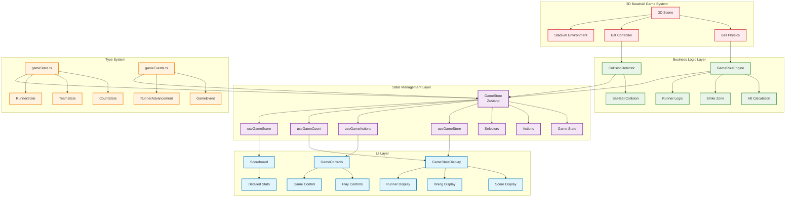
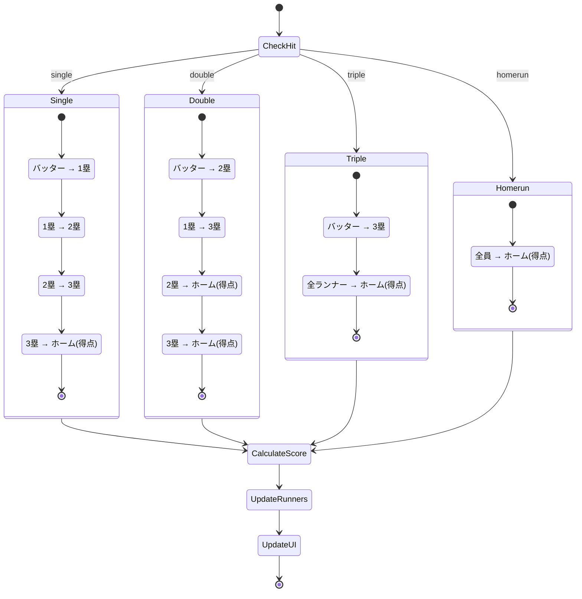
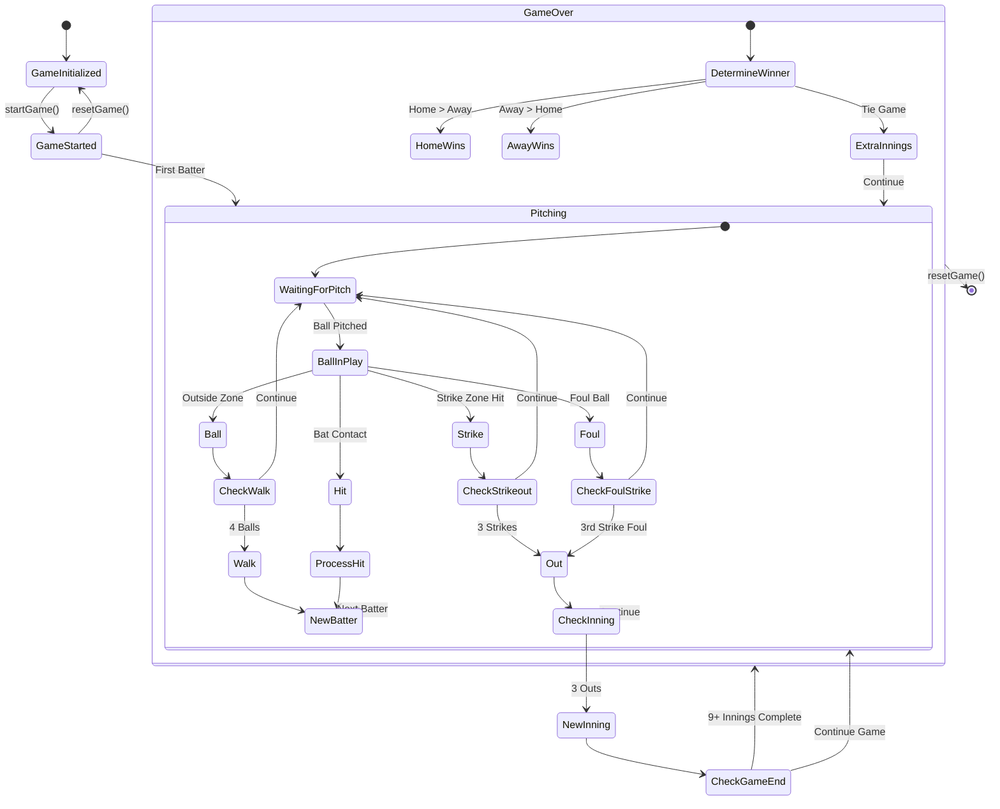
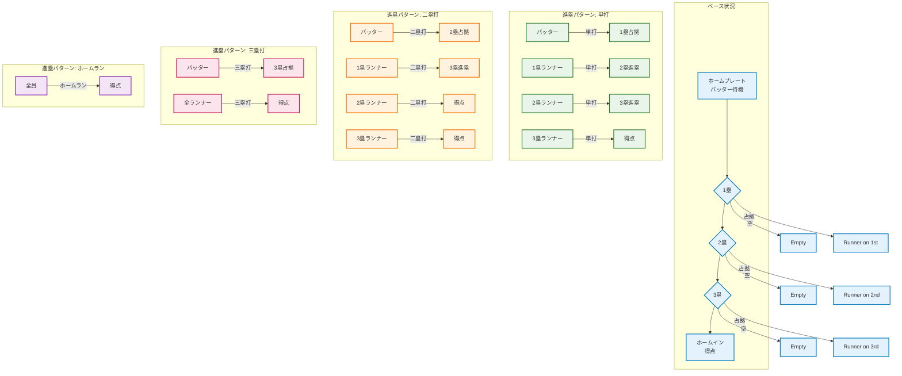
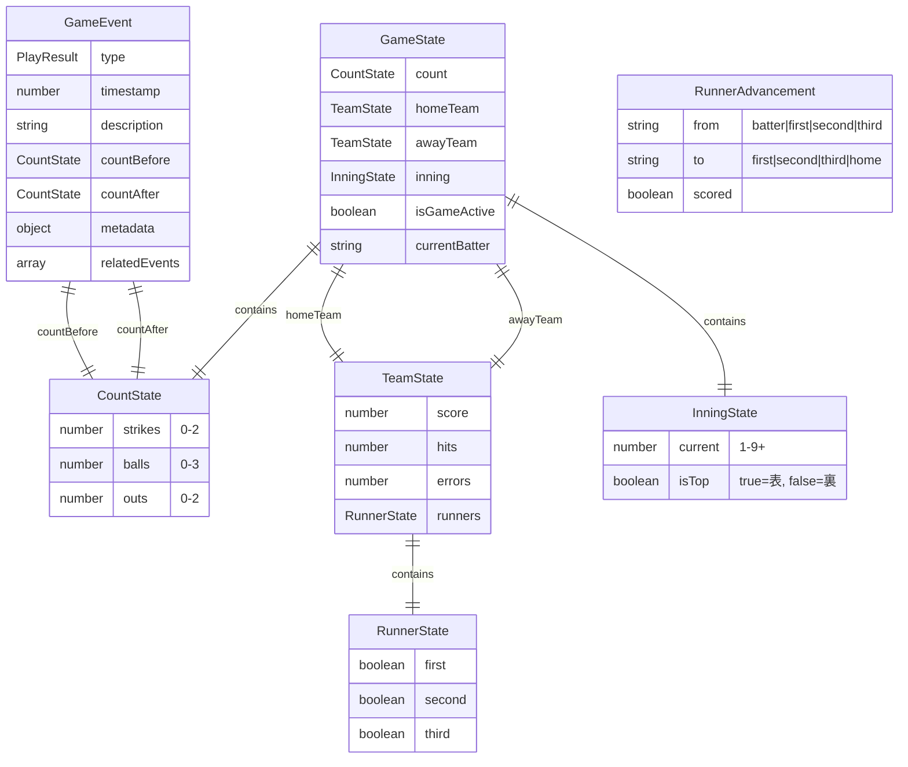
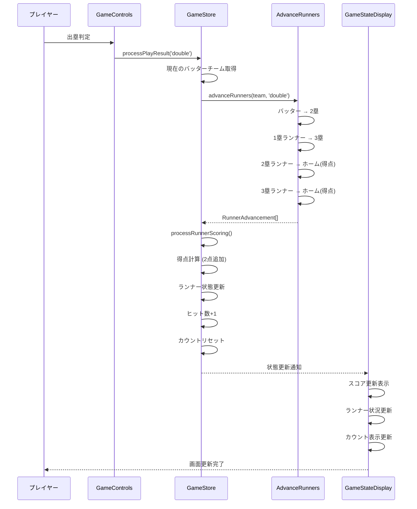
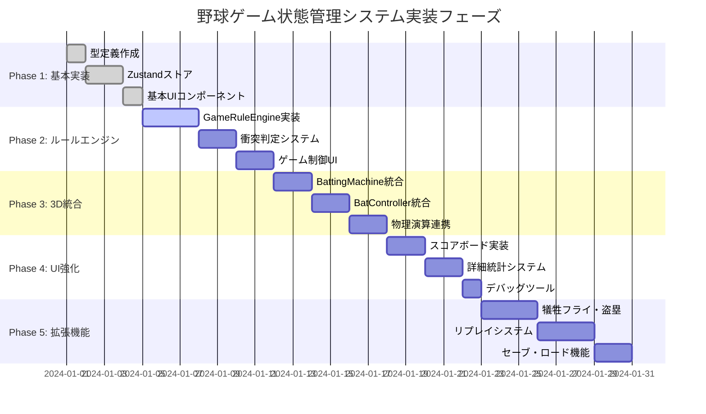
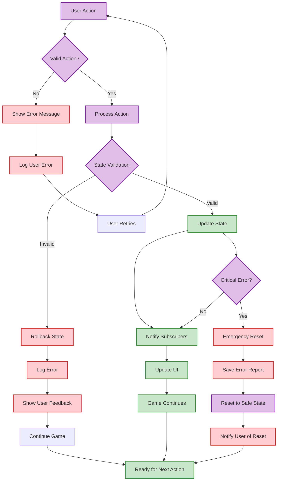

# 野球ゲーム状態管理システム - システム図

## システムアーキテクチャ図



## データフロー図

```mermaid
flowchart TD
    A[3D Ball Physics] -->|Ball Position| B{Strike Zone Check}
    C[Bat Controller] -->|Swing Data| D{Ball-Bat Collision?}
    
    B -->|Strike| E[processPlayResult('strike')]
    B -->|Ball| F[processPlayResult('ball')]
    
    D -->|Hit| G{Calculate Hit Type}
    D -->|Miss| H[processPlayResult('strike')]
    
    G -->|Power > 80| I[processPlayResult('homerun')]
    G -->|Power > 60| J[processPlayResult('triple')]
    G -->|Power > 40| K[processPlayResult('double')]
    G -->|Power <= 40| L[processPlayResult('single')]
    
    E --> M[GameStore Update]
    F --> M
    H --> M
    I --> N[Hit Processing]
    J --> N
    K --> N
    L --> N
    
    N --> O[advanceRunners()]
    O --> P[processRunnerScoring()]
    P --> Q[Update Team State]
    
    M --> R[Count Update]
    R --> S{Check Game State}
    
    S -->|3 Strikes| T[addOut()]
    S -->|4 Balls| U[Walk to 1st Base]
    S -->|3 Outs| V[nextInning()]
    
    Q --> W[UI Update]
    T --> W
    U --> W
    V --> W
    
    W --> X[GameStateDisplay]
    W --> Y[Scoreboard]
    W --> Z[Runner Display]
    
    %% Styling
    classDef physicsNode fill:#ffcdd2,stroke:#d32f2f,stroke-width:2px
    classDef logicNode fill:#dcedc8,stroke:#689f38,stroke-width:2px
    classDef stateNode fill:#e1bee7,stroke:#8e24aa,stroke-width:2px
    classDef uiNode fill:#bbdefb,stroke:#1976d2,stroke-width:2px
    
    class A,C physicsNode
    class B,D,G,O,P,S logicNode
    class E,F,H,I,J,K,L,M,N,Q,R,T,U,V stateNode
    class W,X,Y,Z uiNode
```

## 進塁システムフロー図



## ゲーム状態遷移図



## ランナー状態図



## UI コンポーネント構成図

```mermaid
graph TB
    subgraph "Main Game UI"
        A[App.tsx]
        A --> B[GamePage]
    end
    
    subgraph "3D Scene Layer"
        B --> C[Canvas/Scene]
        C --> D[BaseballStadium]
        C --> E[BattingMachine]
        C --> F[BatController]
        C --> G[Ball Physics]
    end
    
    subgraph "Game UI Layer"
        B --> H[GameStateDisplay]
        B --> I[GameControls]
        B --> J[Scoreboard]
    end
    
    subgraph "GameStateDisplay Components"
        H --> K[Score Display<br/>HOME 0 - 0 AWAY]
        H --> L[Inning Display<br/>1回表]
        H --> M[Count Display<br/>0-0 0OUT]
        H --> N[Runner Display]
        
        N --> O[1塁状態]
        N --> P[2塁状態]
        N --> Q[3塁状態]
    end
    
    subgraph "GameControls Components"
        I --> R[Game Control Panel]
        I --> S[Play Result Controls]
        
        R --> T[Start Game]
        R --> U[Reset Game]
        R --> V[End Game]
        
        S --> W[Strike/Ball]
        S --> X[Hit Types]
        S --> Y[Out/Walk]
        
        X --> Z[Single]
        X --> AA[Double]
        X --> BB[Triple]
        X --> CC[Homerun]
    end
    
    subgraph "Scoreboard Components"
        J --> DD[Team Stats]
        J --> EE[Game Status]
        J --> FF[Detailed Stats]
        
        DD --> GG[HOME Team]
        DD --> HH[AWAY Team]
        
        GG --> II[Score/Hits/Errors]
        HH --> JJ[Score/Hits/Errors]
    end
    
    subgraph "State Connections"
        KK[useGameStore]
        LL[useGameActions]
        MM[useGameCount]
        NN[useGameScore]
    end
    
    %% State connections
    H -.->|subscribe| KK
    H -.->|subscribe| MM
    H -.->|subscribe| NN
    I -.->|actions| LL
    J -.->|subscribe| NN
    
    E -.->|physics events| LL
    F -.->|collision events| LL
    
    %% Styling
    classDef mainNode fill:#ffebee,stroke:#d32f2f,stroke-width:3px
    classDef sceneNode fill:#e8f5e8,stroke:#388e3c,stroke-width:2px
    classDef uiNode fill:#e3f2fd,stroke:#0277bd,stroke-width:2px
    classDef stateNode fill:#f3e5f5,stroke:#7b1fa2,stroke-width:2px
    classDef displayNode fill:#fff3e0,stroke:#f57c00,stroke-width:2px
    
    class A,B mainNode
    class C,D,E,F,G sceneNode
    class H,I,J,K,L,M,N,O,P,Q,R,S,T,U,V,W,X,Y,Z,AA,BB,CC,DD,EE,FF,GG,HH,II,JJ uiNode
    class KK,LL,MM,NN stateNode
```



## データベース/状態構造図



## シーケンス図: ヒット処理



## 実装フェーズ図



## エラーハンドリングフロー



これらのMermaid図により、野球ゲーム状態管理システムの全体像を視覚的に理解できます！